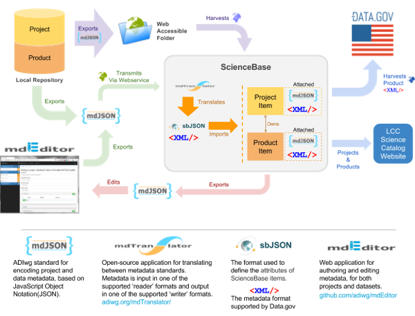

# SA Science Metadata Catalog

# Page description = *{{ page.description }}*

A more detailed look at the metadata requirements and architecture behind the Science Applications Science Catalog.

## Overview2

The SA Science Catalog collates the metadata from all FWS regions and Headquarters. It allows for user-defined searching and filtering of projects and products as well as access to products for download. Users can see what has been funded, which can help prevent duplication of work. The SA Science Catalog also enables reporting, such as funding summaries or project examples based on particular geographies, species, organization, year, or other categories of interest.

#### Architecture2 [editing in progress]

At present, SA creates and edits metadata in mdEditor and then publish the metadata to ScienceBase, where it can be channeled to the SA Science Catalog and data.gov. The mdTranslator tool is integrated with mdEditor so you can create metadata once, and then convert and publish the metadata in your desired format, such as mdJSON for the SA Science Catalog, sbJSON for ScienceBase, XML for data.gov, and FGDC for geospatial data.

_The following diagram details the LCC Science Catalog system architecture._

1. Items are imported from a database (like ScienceBase), or created directly in mdEditor.
2. mdJSON files can also be stored in a local repository and then transmitted via a web service to ScienceBase. Alternately, the local files can be exported to a web accessible folder and then harvested by ScienceBase.
3. The mdTranslator converts the mdJSON files into sbJSON \(the ScienceBase JSON format\), and XML.
4. Items are exported from ScienceBase to: Data.gov as XML; the SA Science Catalog website as Projects and Products; or into mdEditor as mdJSON.

