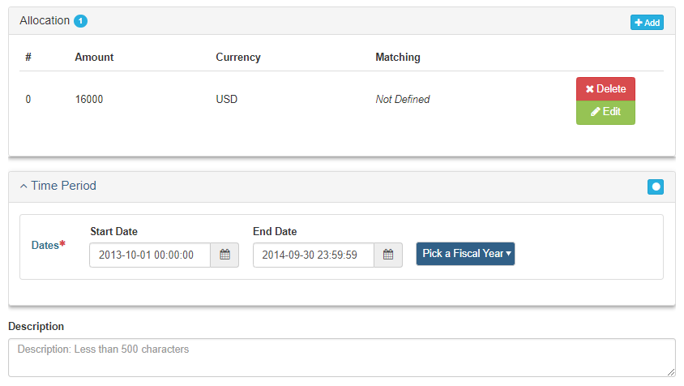
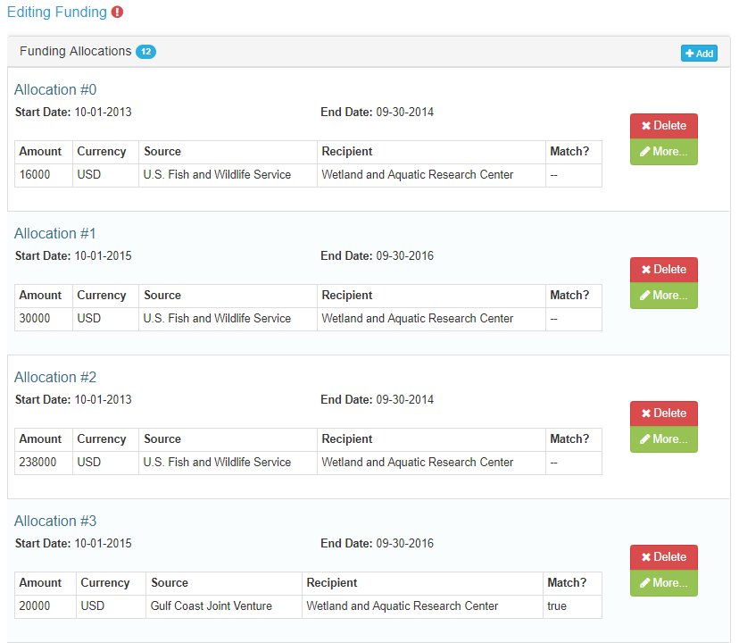

# Funding Tab: Project

Tracking funding in the metadata allows for identification of funding sources and recipients, enables comparisons, and aggregations across all regions.

| **Quick Reference: Project Funding Tab** | Required? |
| :--- | :--- |
| Allocation, including Award ID and Amount | Required |
| Funding Source | Required |
| Funding Recipient Organization | Required |
| Funding Administrator | Required |
| FWS sub-activity and funding codes | Best Practice |
| Funding agreement type | Best Practice |
| Matching Funds, including above | Best Practice |
| Time Period \(fiscal year of allocation\) | Required |

## Funding Allocations

Allocations describe where project funding came from, how much, where and when it was distributed. Science Catalog users can search by specific fiscal year, funders, or recipients.

A funding allocation represents a single fiscal year, source, and recipient.


If you have two recipients in a single fiscal year, each needs to be added as separate funding allocations.


### Required Fields

For each funding allocation, the following fields should be filled out.

#### Award ID \(Required\)

The Award ID numbers are internal codes that connect the distribution forms to the project metadata. Award IDs include grant or cooperative agreement numbers, contract numbers, or inter-agency agreement numbers. Inclusion of Award IDs provides accountability and allows tracking and auditing between financial systems and the Science Catalog.

 If no Award ID exists, then the project is likely an internal effort. Enter '_None_" in the Award ID field. This allows for tracking and search of internally funded projects. 

#### Amount \(Required\)

Enter the amount of funding.  Be sure U.S. Dollars is selected \(ie. Unites States of America, the--US Dollar; this is third from the bottom of USD options in mdEditor\). 

#### Source \(Required\)

Add the relevant contact for the “source” of the project funding. Source should be an organization, not an individual. For SA projects, the most common sources are U.S. Fish and Wildlife Service, Bureau of Land Management, and Bureau of Reclamation. 


Funding source should always identify the agency or organization, rather than a sub-program or office. For example, all funding from other FWS programs need to list U.S. Fish and Wildlife Service as the source \(and not list the source as Fisheries, specific Refuges, ES, etc.\). Clarifications on the exact program or office where the funding came from should be done through the Funding/Other Contacts field.


#### Recipient \(Required\)

Add the relevant contact for the “recipient” of the project funding. Recipient should always be an organization, not an individual. For example, the Principal Investigator would not be listed as the recipient, but their organization would be. If there are multiple recipients for a project, they need to be added as separate allocations.

You could add the Principal Investigator in the Other Contacts field as "principalInvestigator."

#### Other Contacts \(Required\)

In most cases, a program or region has allocated the funding for a project.  In order to track funds within regions and programs and provide proper credit, add the FWS region \(yes, both the legacy region and the DOI unified region for now\) as the funding "administrator" for all allocations. Recall that the funding source should identify the agency who supplied the funding \(i.e. US Fish and Wildlife Service\).  Also, add the program name, if applicable, as a the funding "administrator".  


Funding administrator can also be used to differentiate funding from different programs/offices within the same agency. For example, the U.S. Fish and Wildlife Service can be identified as the funding source and the funding administrator could include "Ecological Services" or a specific field office.


In some cases, funds are marked for specific activities and include reporting requirements accompany the funding allocations.  For example, EPA allocates Great Lakes Restoration Initiative \(GLRI\) funds on behalf of Congress to FWS, among others. FWS then distributes the funds across programs for use.  This funding flow can be tracked and aggregated with the Funding Other Contacts.  Add the Name of the funding source as an organization contact and add the funding source as the "_funder_" in Funding Other Contacts.

#### FWS sub-activity, funding codes, agreement type \(Best Practice\)

In order to better integrate budgeting records and align with activity tracking priorities, add the FWS sub-activity code and funding code in the Allocation comments. Also add the funding For example, the text entry may look like this:  FWS sub-activity 1420, fundcode 190, contract.  If funds are provided from multiple sub-activities, please add this in the description \(i.e. FWS sub-activity 1430, fundcode 170, $30,000: sub-activity 1420, fundcode 170, $10,000\). At some point in the future, mdEditor may include additional fields for these values.

#### Matching and In-kind Funds

Project funds or in-kind support that were supplied by a partner \(i.e., not specifically allocated to SA\) should be included as an allocation as described above, but with the matching fund box checked. Each matching fund provider needs to be included as a separate allocation.

## Time Period

### Dates \(Required\)

For each allocation, enter the fiscal year that funds were awarded \(not the time span of the entire project\). There should be a single fiscal year for each allocation. Adding a time period lets users know when your items were funded, and lets them find your item when searching for items funded in a similar time period.


Use the “Pick a Fiscal Year” dropdown to autofill the date fields.


Example of multiple allocations across several fiscal years for a single project record.

